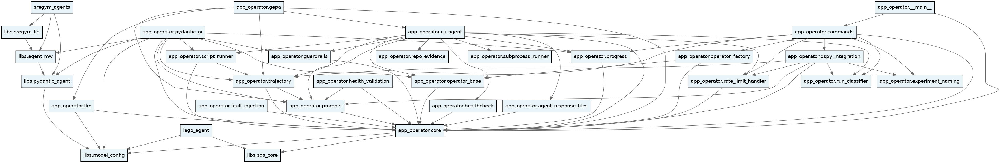

# SDS Architecture

This document explains how the components of SDS fit together, covering providers, runtimes, agent relationships, trajectories, and the full command reference. Start here if you want to understand the system before diving into a specific feature doc.

---

## Component Map

```
agentshim/          provider abstraction (CodingAgent ABC, AGENT_REGISTRY)
     ├── app_operator/   sds_operator — deploy, monitor, optimize
     │     ├── cli_agent/    runtime: cli_agent (default)
     │     ├── trajectory.py recording
     │     ├── dspy_integration/ offline optimization
     │     └── prompts/      Jinja2 + DSPy-optimized templates
     └── lego_agent/     sds_lego_agent — agent workflow generation
```

### Module Dependency Graph

The graph below is generated from `tach.toml` by `scripts/generate_tach_graph.sh`. Arrows point from a module to its dependency.



Both `sds_operator` and `lego_agent` share `agentshim/` for provider access and read from `sds.toml`, but do not share business logic.

---

## Package Boundaries and Import Rules

### Layer ordering

`app_operator` is divided into layers. Code in a higher layer may import from lower layers, but not the reverse.

```
Layer 5  __main__          entry points only
Layer 4  commands/         CLI command orchestration
Layer 3  cli_agent/        runtime implementations
Layer 2  dspy_integration/ prompt optimisation tools
         fault_injection/
         gepa/
Layer 1  prompts/          Jinja2 + DSPy templates
         trajectory.py     recording
Layer 0  config, types,    foundational (no internal deps)
         exceptions,
         constants, …
```

`libs/` sits below everything: `libs.sds_core` is the foundation of `libs`; `agentshim` is the provider abstraction. Neither may import from `app_operator` or `lego_agent`.

### Façade rule

Each subpackage exposes its public API through `__init__.py` only. Code outside a package must import from the package root, not from internal submodules:

```python
# correct
from app_operator.dspy_integration import DSPyConfig

# violation — bypasses the façade
from app_operator.dspy_integration.config import DSPyConfig
```

Every subpackage `__init__.py` declares `__all__` to make the public surface explicit.

Two categories of accepted exceptions (documented in `tests/unit/test_architecture.py`):

- **`prompts.*` submodules** — `deployer.py`, `deployment_context.py`, `subagent.py`, `rlm.py` each import back from `app_operator.prompts`, so re-exporting them from `prompts/__init__.py` would create a circular import. Direct submodule access is allowlisted.
- **`dspy_integration` heavy classes from `commands/`** — `optimizer.py`, `signatures.py`, `metrics_aggregator.py`, `eval_execute.py` import `dspy` at module level. Keeping them out of `dspy_integration/__init__.py` prevents `import dspy` from firing whenever any code touches the package (e.g. loading `DSPyConfig` at agent startup). Direct imports in `commands/` preserve lazy-load behaviour.

### How boundaries are enforced

Two complementary mechanisms run in CI via `scripts/check_errors.sh`:

**1. `tach check`** — `tach.toml` defines module boundaries with explicit `depends_on` allowlists covering layer ordering, runtime isolation, and provider abstraction. Run with `uv run tach check`.

**2. AST tests** — `tests/unit/test_architecture.py` uses Python's `ast` module to enforce three rules across every `.py` file at test time:

| Rule | What it checks |
|---|---|
| Façade rule | Cross-package imports go through `__init__.py`, not internal submodules |
| Private module rule | `_`-prefixed submodules cannot be imported from outside their package |
| `__all__` rule | Every non-trivial subpackage `__init__.py` declares `__all__` |

Heavy symbols (those that transitively pull in `dspy` or `litellm`) are lazy-loaded via `__getattr__` in their package `__init__.py`, so the façade rule is satisfied without import-time overhead.

---

## Provider Abstraction

`agentshim/` provides a `CodingAgent` ABC and a `create_agent_from_config()` factory. Both tools instantiate agents through this layer; no provider-specific code lives in the tools themselves.

Supported providers and required credentials:

| Provider | Env var(s) |
|---|---|
| `gemini` (Vertex AI) | `GOOGLE_APPLICATION_CREDENTIALS`, `GOOGLE_CLOUD_PROJECT`, `GOOGLE_CLOUD_LOCATION` |
| `gemini` (LangChain) | `GOOGLE_API_KEY` |
| `claude` / `claude-code` / `anthropic` | `ANTHROPIC_API_KEY` |
| `codex` / `opencode` / `openai` | `OPENAI_API_KEY` |
| `rlm` | `GOOGLE_APPLICATION_CREDENTIALS` + litellm-compatible model string |

Set credentials in `.env` at the project root.

---

## Runtimes

The runtime controls how each agent call is orchestrated. It is orthogonal to the provider. Switching runtimes requires only changing `[runtime] impl` in `sds.toml`.

### `cli_agent` (default)

Communicates with external coding agents via their CLI interfaces. Broadest provider support: `codex`, `gemini`, `claude`, `claude-code`, `opencode`, `rlm`. No extra dependencies.

---

## Operator Agents and Their Relationships

The operator always runs agents in this sequence:

```
1. CodeAnalyzerAgent   reads the target codebase
                       writes .sds/code_analysis.md
                              ↓ (passed as context)
2. DeploymentAgent     generates deploy.sh + health_check.sh
                       runs deploy.sh
                       on failure: reads error → generates fix → retries
                       (up to deployment_max_iters)
                              ↓ (only after successful deploy)
3. AppMonitor          runs health_check.sh periodically
                       on failure: triggers re-deploy (back to step 2)
                       (up to monitoring_max_iters)
```

The `CodeAnalyzerAgent` output is not optional context — it is injected into the `DeploymentAgent` prompt as understanding of the app's structure. This is what allows the deployment agent to generate scripts that fit the specific application rather than generic boilerplate.

The `DeploymentAgent` self-healing loop: generate → run → read error → fix → retry. Each iteration is recorded in a trajectory.

Agent call sequence is fixed by the operator. The runtime determines how each individual agent call is invoked, not the order.

---

## Trajectories and the Optimization Loop

Each `sds_operator run` writes trajectory files to `.sds/trajectories/`. A trajectory record contains:
- `phase`: `deployment`, `monitoring`, `code_analysis`, etc.
- `prompt`: the rendered prompt text sent to the agent
- `response`: the agent's response
- `tokens`: input/output token counts
- `success`: whether this call contributed to a successful outcome
- `call_id`: sequential ID for ordering calls within a run

The optimization loop:

```
1. Run deployments       ./sds_operator run <app>
                                ↓
2. Inspect metrics       ./sds_operator analyze-prompts --phase deployment
                                ↓
3. Optimize prompts      ./sds_operator optimize-prompts \
                             --prompts deployer_fix_error --optimizer BootstrapFewShot
                                ↓ (writes to app_operator/prompts/optimized/vN/)
4. Activate              set use_optimized = true in sds.toml
                                ↓
5. Compare               ./sds_operator analyze-prompts \
                             --compare .sds/trajectories:optimized_trajectories
```

Optimized prompts live in versioned directories under `app_operator/prompts/optimized/`. A `latest` symlink points to the most recent version. See `docs/dspy-optimization.md` for the full workflow.

---

## Full Command Reference

### `run`

Deploy and monitor an application with autonomous error fixing.

```bash
./sds_operator run <DIR> [--config <FILE>] [--tui]
```

### `init-exp`

Initialize an isolated experiment copy of an application.

```bash
./sds_operator init-exp <APP_PATH> <EXP_NAME>
```

- `APP_PATH`: source application directory
- `EXP_NAME`: name for the new experiment (written to `exp/<app>/<name>/`)

### `run-exp`

Run all apps in an experiment config in parallel.

```bash
./sds_operator run-exp <EXPERIMENT_NAME_OR_PATH> [--parallel <N>]
```

Reads `exp_config/<name>/config.toml`. After all apps complete, writes `results.json` to the log directory and prints a summary table.

### `analyze-prompts`

Compute metrics on trajectory data: success rates, iteration efficiency, token costs.

```bash
./sds_operator analyze-prompts [OPTIONS]
```

**Options:**

| Option | Description |
|---|---|
| `--trajectories-dir <DIR>` | Trajectory directory (default: `.sds/trajectories`) |
| `--phase <PHASE>` | Filter by phase: `deployment`, `monitoring`, `script_generation`, `exploration` |
| `--model <MODEL>` | Model name for cost calculation (e.g., `claude-sonnet-4-5`) |
| `--format <FORMAT>` | Output format: `table` or `json` (default: `table`) |
| `--compare <DIRS>` | Compare two dirs: `baseline_dir:optimized_dir` |

### `optimize-prompts`

Run offline prompt optimization using DSPy.

```bash
./sds_operator optimize-prompts [OPTIONS]
```

**Options:**

| Option | Description |
|---|---|
| `--prompts <NAMES>` | Prompt names to optimize (required, or use `--list-prompts`) |
| `--trajectories-dir <DIR>` | Trajectory data directory (default: `.sds/trajectories`) |
| `--output-dir <DIR>` | Output directory (default: auto-versioned) |
| `--config <FILE>` | Path to `sds.toml` |
| `--optimizer <TYPE>` | DSPy optimizer: `BootstrapFewShot`, `BootstrapFewShotWithRandomSearch`, `MIPROv2`, `COPRO` |
| `--num-examples <N>` | Training examples (default: from config or 30) |
| `--teacher-model <MODEL>` | Teacher model (default: from config or `claude-sonnet-4-5`) |
| `--dry-run` | Validate inputs without running |
| `--list-prompts` | List available prompts and exit |

**Available prompts:**

| Name | Description |
|---|---|
| `deployer_system` | System instructions for deployment agent |
| `deployer_generate_script` | Generate deployment scripts |
| `deployer_fix_error` | Fix deployment errors |
| `deployer_summarize` | Summarize deployment results |
| `code_analyzer_system` | System instructions for code analysis |
| `code_analyzer_user` | Analyze codebase for deployment |
| `monitor_analyze_health` | Analyze application health |
| `agentflow_system` | System instructions for agentflow |
| `agentflow_user` | Generate agentflow scripts |
| `agentflow_repair` | Repair malformed responses |

### `viz-graph`

Visualize the agent dependency graph (LangGraph runtime only).

```bash
./sds_operator viz-graph [-o graph.png]
```

---

## Experiment Workflow

Experiments allow controlled A/B testing of operator configurations.

### Setup

```bash
# 1. Create isolated copies of the target app
./sds_operator init-exp apps/deathstarbench/hotelReservation my-test-run

# 2. Run the operator on the experiment
./sds_operator run exp/hotelReservation/my-test-run
```

### Multi-experiment parallel runs

```bash
./sds_operator run-exp <exp-name> --parallel 2
```

This reads `exp_config/<exp-name>/config.toml`. Example:

```
exp_config/
├── with-ltm/config.toml
└── without-ltm/config.toml
```

### Per-experiment config overrides

Experiment configs can include any standard `sds.toml` sections alongside `apps`. These are written as `sds.toml` into each experiment directory before the run, overriding the app's own config.

```toml
# exp_config/with-ltm/config.toml
apps = [
    "apps/deathstarbench/hotelReservation",
    "apps/deathstarbench/socialNetwork"
]

[operator.phase]
fix_summary_consolidation = true
```

Any section valid in `sds.toml` (`[agent]`, `[operator]`, `[runtime]`, etc.) can be used as an override.

See [`docs/feature-flags.md`](feature-flags.md) for the full list of `[operator.phase]` flags.

---

## DSPy Configuration: Canary Deployment and Auto-Rollback

### Full DSPy config block

```toml
[dspy]
use_optimized = false           # Use DSPy-optimized prompts
optimized_version = "latest"    # Version to use ("v1", "v2", "latest")
fallback_to_baseline = true     # Fall back to Jinja2 on errors
enable_online_learning = false  # Enable feedback collection
feedback_sample_rate = 0.1      # Fraction of runs to collect feedback

[dspy.optimization]
optimizer = "BootstrapFewShot"       # DSPy optimizer
teacher_model = "claude-sonnet-4-5"  # Model for optimization
num_examples = 30                    # Training examples
validation_split = 0.2               # Validation data fraction

[dspy.optimization.metric_weights]
success = 0.6      # Deployment success (binary)
efficiency = 0.25  # Iteration efficiency
tokens = 0.15      # Token efficiency
```

### Canary deployment

Roll out optimized prompts to a percentage of deployments:

```toml
[dspy]
use_optimized = true
canary_deployment = true
canary_percentage = 0.2  # 20% of deployments use optimized prompts
```

Routing is deterministic per repository (based on `hash(repo_path)`), ensuring consistent behavior for debugging.

### Auto-rollback

Automatically revert to baseline prompts if performance degrades:

```toml
[dspy.auto_rollback]
enabled = true
success_rate_threshold = 0.05  # Rollback if success rate drops by 5%
evaluation_window = 100        # Evaluate over last 100 runs
```

### Optimized prompt file structure

```
app_operator/prompts/optimized/
├── v1/
│   ├── deployer_fix_error.dspy.json
│   ├── deployer_summarize.dspy.json
│   └── metadata.json
├── v2/
│   └── ...
└── latest -> v2
```
